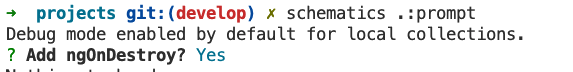

# Schematic prompts

Schematic prompts introduce user interaction into schematic execution. Configure schematic options to display a customizable question to the user. The prompts are displayed before the execution of the schematic, which then uses the response as the value for the option. This lets users direct the operation of the schematic without requiring in-depth knowledge of the full spectrum of available options.

The "Hello World" schematic might, for example, ask the user for their name, and display that name in place of the default name "world". To define such a prompt, add an x-prompt property to the schema for the name variable.


Similarly, you can add a prompt to let the user decide whether the schematic uses color when executing its hello action. The schema with both prompts would be as follows.
```json
{
    "properties": {
        "name": {
            "type": "string",
            "minLength": 1,
            "default": "world",
            "x-prompt": "What is your name?"
        },
        "useColor": {
            "type": "boolean",
            "x-prompt": "Would you like the response in color?"
        }
    }
}
```
## Prompt short-form syntax
These examples use a shorthand form of the prompt syntax, supplying only the text of the question. In most cases, this is all that is required. Notice however, that the two prompts expect different types of input. When using the shorthand form, the most appropriate type is automatically selected based on the property's schema. In the example, the name prompt uses the input type because it it is a string property. The useColor prompt uses a confirmation type because it is a Boolean property. In this case, "yes" corresponds to true and "no" corresponds to false.

There are three supported input types.

| Input type| Details |
| - | - |
| confirmation | A yes or no question; ideal for Boolean options.
|input | Textual input; ideal for string or number options.
| list|	A predefined set of allowed values.
	
	
In the short form, the type is inferred from the property's type and constraints.

| Property schema| Prompt type |
| - | - |
| "type": "boolean"|	confirmation ("yes"=true, "no"=false)
|"type": "string"|input
|"type": "number"|input (only valid numbers accepted)
|"type": "integer"	| input (only valid numbers accepted)
|"enum": […]	| list (enum members become list selections)

Examples with real examples:

### Confirmation

* type = boolean

```json
{
    ...
    "ngOnDestroy": {
        "type": "boolean",
        "x-prompt": "Add ngOnDestroy?",
        "description": "Question about use ngOnDestroy function with log."
    }
}
```
In terminal:



### Input
* type = string

```json
{
    ...
    "name": {
        "type": "string",
        "x-prompt": "What´s your name?",
        "description": "Input our first name"
    }
}
```
In terminal:


* type = number

```json
{
    ...
    "height": {
        "type": "number",
        "description": "Question about use ngOnDestroy function with log.",
        "default": 100
    }
}
```
In terminal:


In the following example, the property takes an enumerated value, so the schematic automatically chooses the list type, and creates a menu from the possible values.

```json
"style": {
  "description": "The file extension or preprocessor to use for style files.",
  "type": "string",
  "default": "css",
  "enum": [
    "css",
    "scss",
    "sass",
    "less"
  ],
  "x-prompt": "Which stylesheet format would you like to use?"
}
```

The prompt runtime automatically validates the provided response against the constraints provided in the JSON schema. If the value is not acceptable, the user is prompted for a new value. This ensures that any values passed to the schematic meet the expectations of the schematic's implementation, so that you do not need to add additional checks within the schematic's code.

## Prompt long-form syntax
The x-prompt field syntax supports a long form for cases where you require additional customization and control over the prompt. In this form, the x-prompt field value is a JSON object with subfields that customize the behavior of the prompt.

| Field	| Data value
| - | - |
| type | confirmation, input, or list (selected automatically in short form)
| message |	string (required)
| items	 | string and/or label/value object pair (only valid with type list)


The following example of the long form is from the JSON schema for the schematic that the CLI uses to generate applications. It defines the prompt that lets users choose which style preprocessor they want to use for the application being created. By using the long form, the schematic can provide more explicit formatting of the menu choices.

```json
"style": {
  "description": "The file extension or preprocessor to use for style files.",
  "type": "string",
  "default": "css",
  "enum": [
    "css",
    "scss",
    "sass",
    "less"
  ],
  "x-prompt": {
    "message": "Which stylesheet format would you like to use?",
    "type": "list",
    "items": [
      { "value": "css",  "label": "CSS" },
      { "value": "scss", "label": "SCSS   [ https://sass-lang.com/documentation/syntax#scss                ]" },
      { "value": "sass", "label": "Sass   [ https://sass-lang.com/documentation/syntax#the-indented-syntax ]" },
      { "value": "less", "label": "Less   [ http://lesscss.org/                                            ]" }
    ]
  },
},
```

Practice example description (pending)